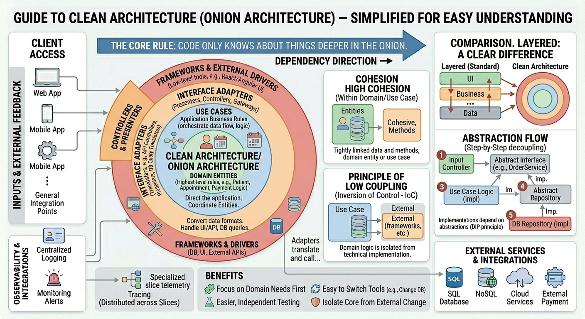
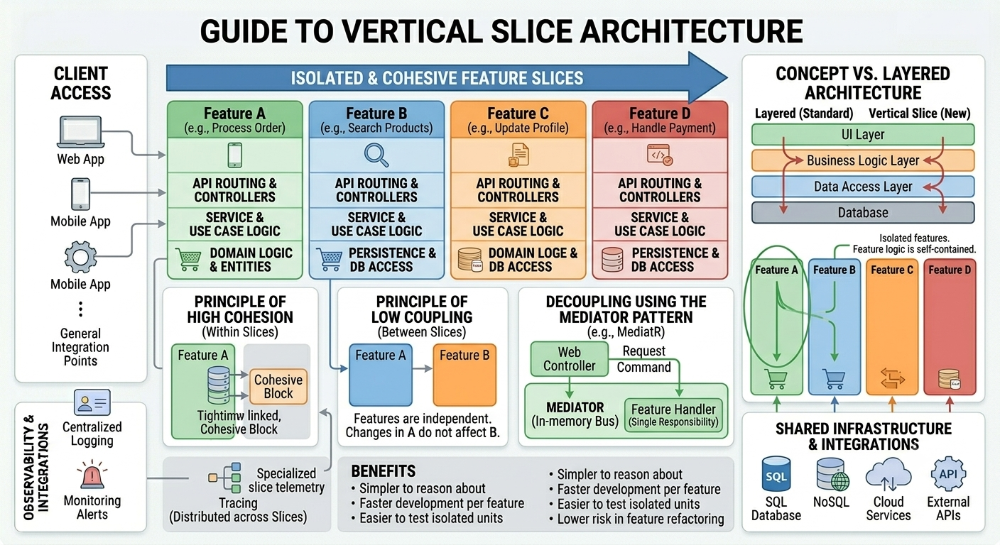
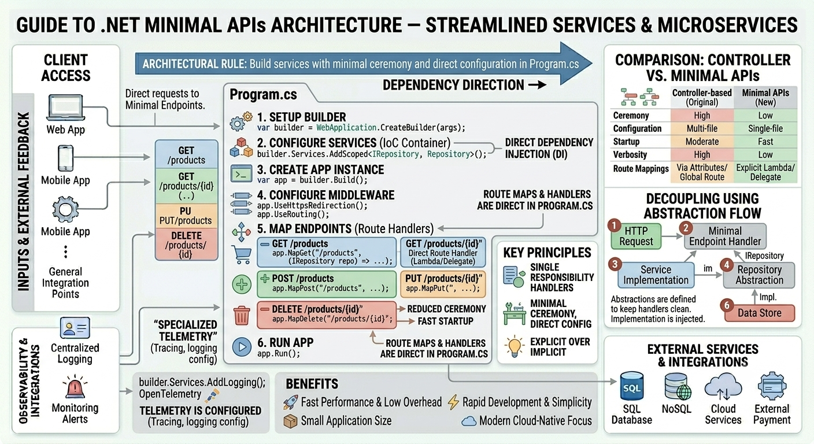
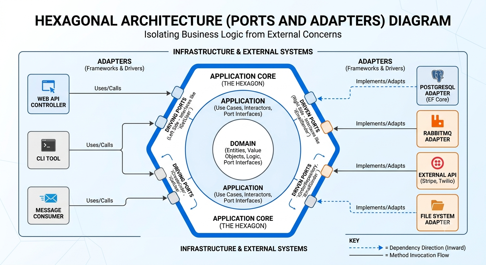
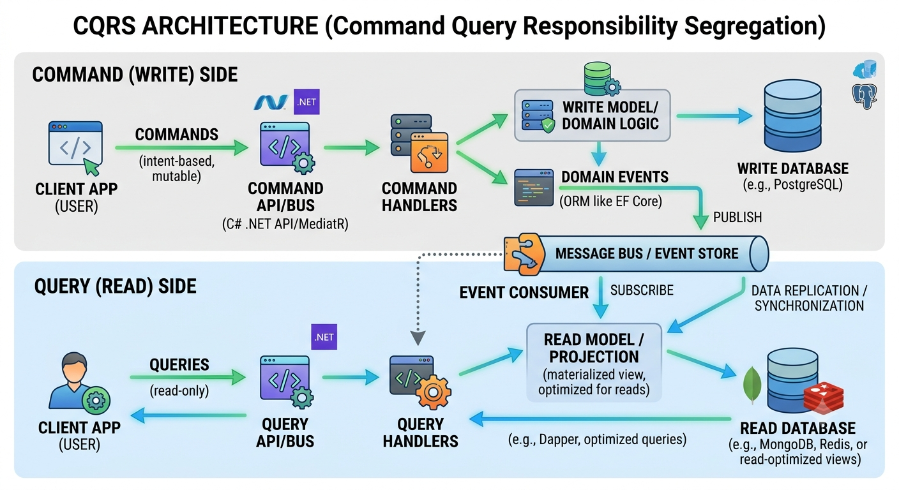
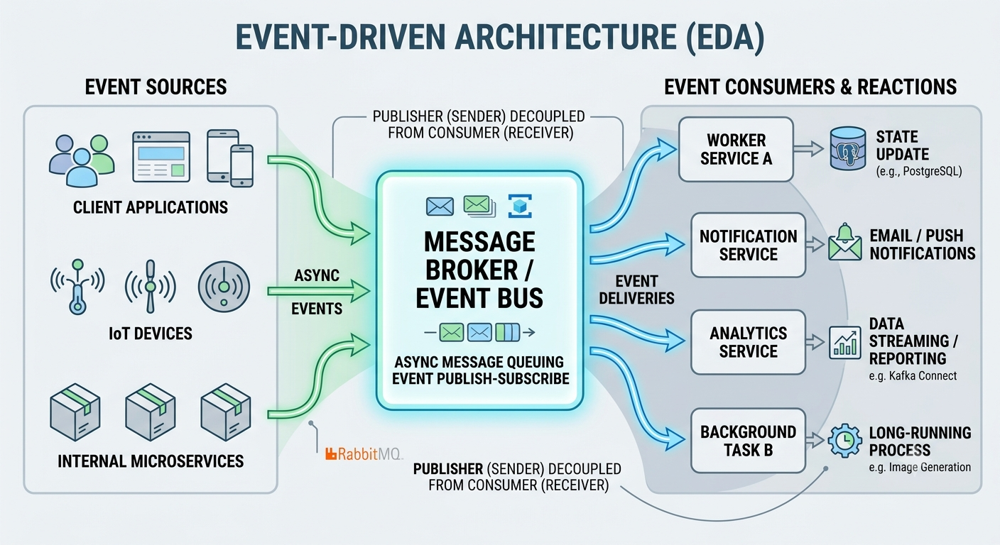
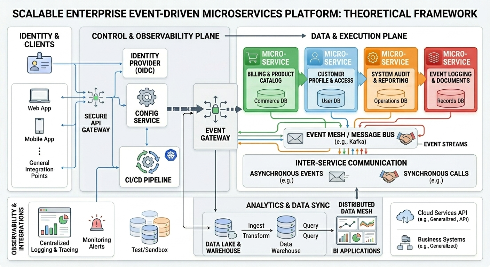
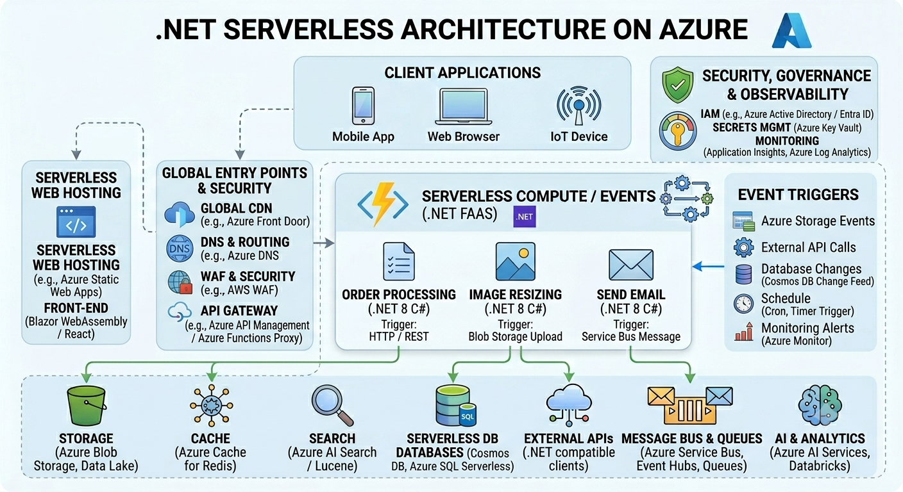

# .NET Architectural Patterns Synthesis

A comprehensive guide to architectural patterns for .NET applications, ranging from simple monolithic structures to complex distributed systems. This repository serves as a reference for selecting the right architecture based on project scale, team size, and business requirements.

## 1. Core Architectural Patterns

* **Clean Architecture (Onion Architecture):** The "gold standard" for enterprise applications. It relies on the Dependency Rule, where source code dependencies point only inwards, keeping the Domain independent of infrastructure.
  


```text
src/
├── Core/                       # The innermost circle (Domain logic)
│   ├── Domain/                 # Enterprise Business Rules (Entities, Value Objects, Enums)
│   │   ├── Entities/
│   │   ├── ValueObjects/
│   │   └── Interfaces/         # Repository/Service interfaces that Domain needs
│   └── Application/            # Application Business Rules
│       ├── UseCases/           # Implementation of business processes
│       ├── DTOs/               # Data Transfer Objects
│       └── Interfaces/         # Interfaces for external dependencies (e.g., IEmailService)
├── Infrastructure/             # Implementation of Interfaces defined in Core
│   ├── Persistence/            # Database contexts, migrations, repositories
│   ├── Services/               # Third-party API implementations, Email, Logging
│   └── External/               # Cache providers, message queues
└── Presentation/               # The outermost circle (UI)
    ├── API/                    # Controllers, Middlewares, Filters
    ├── Client/                 # Frontend (if monolithic)
    └── Configuration/          # DI Registrations, App settings
```
 ---
  
* **Vertical Slice Architecture:** Organizes code by features (e.g., "AddProduct") rather than technical concerns. It offers high cohesion and reduces friction by keeping all feature-specific logic localized.
  


```text
src/
├── Features/
│   ├── Orders/
│   │   ├── CreateOrder/
│   │   │   ├── CreateOrderEndpoint.cs    # The API definition (Controller/Minimal API)
│   │   │   ├── CreateOrderCommand.cs     # The Request model
│   │   │   ├── CreateOrderHandler.cs     # The Business Logic
│   │   │   ├── CreateOrderValidator.cs   # Validation logic
│   │   │   └── OrderCreatedEvent.cs      # Domain event (if needed)
│   │   ├── GetOrderById/
│   │   │   ├── GetOrderEndpoint.cs
│   │   │   ├── GetOrderQuery.cs
│   │   │   └── GetOrderHandler.cs
│   ├── Users/
│   │   ├── RegisterUser/
│   │   └── LoginUser/
├── Shared/                               # Cross-cutting concerns (common across slices)
│   ├── Database/
│   ├── Infrastructure/
│   └── Logging/
└── Program.cs                            # Entry point / DI Registration
```
---
* **Minimal APIs:** The modern approach for lightweight, scalable APIs. It removes MVC boilerplate and pairs perfectly with Vertical Slice architecture.


```text 
src/
├── Endpoints/                  # Groups of endpoints (feature-based or resource-based)
│   ├── UserEndpoints.cs        # Maps routes and handlers for Users
│   ├── OrderEndpoints.cs       # Maps routes and handlers for Orders
│   └── IEndpointDefinition.cs  # Interface to standardize endpoint registration
├── Models/                     # DTOs, Requests, and Responses
├── Services/                   # Business logic / Orchestration
├── Data/                       # Database Context and Repositories
├── Program.cs                  # Entry point, DI container, and middleware
└── appsettings.json
```
---
* **Hexagonal Architecture (Ports and Adapters):** Similar to Clean Architecture, this focuses on isolating the application core from external frameworks and tools using interfaces (Ports) and implementations (Adapters).


```text 
MySolution.sln
├── src/
│   ├── MyProject.Core/             # Pure Business Logic (Class Library)
│   │   ├── Domain/                 # Entities, Domain Events
│   │   │   └── IUserRepository.cs  # Driven Port (Interface)
│   │   └── Application/            # Use Cases, DTOs
│   │       └── UserService.cs      # Driving Port (Orchestrates logic)
│   │
│   ├── MyProject.Infrastructure/   # Implementation of Driven Ports
│   │   ├── Persistence/
│   │   │   └── SqlUserRepository.cs # Implements IUserRepository
│   │   └── ExternalServices/
│   │
│   └── MyProject.Api/              # Driving Adapter (Web API)
│       ├── Controllers/
│       │   └── UserController.cs   # Calls UserService
│       └── Program.cs              # Dependency Injection Container
│
└── tests/
    ├── MyProject.Core.Tests/       # Unit tests for Domain/Application
    └── MyProject.Infrastructure.Tests/ # Integration tests for DB/External APIs
```
---
* **CQRS:** Separates read and write operations. Excellent for high-performance needs and complex audit trails, allowing for specialized storage technologies per operation type.



```text 
MyProject.Api/
├── Features/
│   ├── Orders/
│   │   ├── CreateOrder/
│   │   │   ├── CreateOrderCommand.cs         # Request object
│   │   │   └── CreateOrderCommandHandler.cs  # Business Logic
│   │   ├── GetOrderById/
│   │   │   ├── GetOrderByIdQuery.cs          # Request object
│   │   │   └── GetOrderByIdQueryHandler.cs   # Read logic (Dapper/EF)
│   │   └── OrdersController.cs               # Minimal API or Controller
│   │
│   └── Users/
│       └── ...
├── Infrastructure/                           # EF Core, Dapper, Email clients
├── Domain/                                   # Entities, Value Objects
└── Program.cs                                # MediatR and DI Registration
```
  
---
* **Event-Driven Architecture (EDA):** Built around the production, detection, and consumption of events. It is ideal for systems requiring high decoupling and asynchronous responsiveness.


 ---
  
* **Microservices:** Ideal for large-scale systems requiring independent deployment. Leverages ASP.NET Core with Docker/Kubernetes, often using Dapr, gRPC, and MassTransit.


---
* **Serverless Architecture:** A cloud-native design where infrastructure management is offloaded to a provider, and the application logic is executed in response to events (e.g., AWS Lambda).


---

## 2. Recommendation Matrix

| Project Scale | Recommended Pattern |
| :--- | :--- |
| **Simple / Small** | Monolithic Layered Architecture |
| **Enterprise / Complex** | Clean Architecture |
| **Feature-Rich / Team** | Vertical Slice Architecture |
| **Massive / Distributed** | Microservices with CQRS |

---

## 3. Scaling Enterprise Applications

Modern enterprise development often combines **Domain-Driven Design (DDD)** Bounded Contexts with **Clean Architecture**.

### The Combined Approach
By layering Clean Architecture *inside* each DDD Bounded Context, you create a robust, modular structure:
* **Bounded Context Layer:** Defines the high-level domain boundary.
* **Clean Architecture Inner Layers:** Each module contains its own:
    * **Domain:** Entities and business rules.
    * **Application:** Use cases, commands, and queries.
    * **Infrastructure:** Database contexts and repository implementations.
```text
Solution.Root/
├── src/
│   ├── BoundedContexts/
│   │   ├── Billing/
│   │   │   ├── Billing.Domain/
│   │   │   ├── Billing.Application/
│   │   │   └── Billing.Infrastructure/
│   │   └── Inventory/
│   │       ├── Inventory.Domain/
│   │       ├── Inventory.Application/
│   │       └── Inventory.Infrastructure/
│   └── SharedKernel/              # Common Domain logic shared across contexts
├── Solution.API/                  # Entry point coordinating across contexts
└── tests/
```

---

## 4. Architectural Selection Matrix

| Architecture | Primary Focus | Best For | Complexity | Scalability |
| :--- | :--- | :--- | :--- | :--- |
| **Microservices** | Decoupling services | Large, complex enterprise systems | High | High |
| **Vertical Slice** | Feature-based cohesion | Rapid feature development | Low-Medium | Medium |
| **Clean Architecture** | Domain isolation | Long-term maintainability | Medium-High | Medium |
| **Hexagonal** | Infrastructure decoupling | Complex business logic | Medium | Medium |
| **Minimal APIs** | Lightweight endpoints | Small services, micro-tasks | Very Low | High |
| **CQRS** | Read/Write segregation | High-performance, complex queries | High | High |
| **Event-Driven** | Asynchronous communication | Distributed systems, decoupling | High | High |
| **Serverless** | Managed infrastructure | Event-triggered, variable load | Low | Very High |

---

## 5. Architectural Pros & Cons Matrix

| Architecture | Pros | Cons |
| :--- | :--- | :--- |
| **Microservices** | Independent deployment, technology diversity, granular scaling. | High operational overhead, distributed transaction complexity, network latency. |
| **Vertical Slice** | High cohesion, fast feature delivery, simple to navigate. | Potential for code duplication across slices, lacks global consistency. |
| **Clean Architecture** | Framework/database independence, testable domain logic. | Over-engineering for simple tasks, high boilerplate code. |
| **Hexagonal** | Highly testable, easy to swap infrastructure, clear domain boundaries. | Steep learning curve, requires careful mapping (Ports/Adapters). |
| **Minimal APIs** | Extreme performance, minimal boilerplate, low memory footprint. | Limited structure for large applications, can become unmaintainable if bloated. |
| **CQRS** | Optimized read/write models, scalable data access, flexible scaling. | Eventual consistency challenges, high complexity to implement and sync. |
| **Event-Driven** | Loose coupling, high fault tolerance, asynchronous responsiveness. | Difficult to debug/trace, complex error handling, eventual consistency. |
| **Serverless** | Zero server management, auto-scaling, pay-per-execution costs. | Vendor lock-in, cold-start latency, limited control over environment. |


